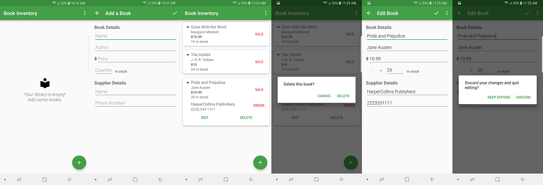

# Book Inventory

An inventory app for a library or bookstore.

* Built for API 15 or higher
* Two activities: CatalogActivity and EditActivity
* Uses SQLite to store data

## Basic structure:

Empty state is displayed upon startup, telling the user to add books.

The user can click the floating action button to open the EditActivity.

EditText fields take input for name, author, price, quantity, supplier name, and supplier phone number.

Input is added to the RecyclerView in the CatalogActivity.

Contract and SQLiteOpenHelper files provide the schema and methods containing SQL statements.

## Additions for Stage 2 project:

A Sale button for each RecyclerView item to decrease the quantity by 1.

ExpandableLayout, when clicked, displays the details of an item, as well as the Order, Edit and Delete buttons.

Order button sends an implicit intent to the phone app.

Quantity buttons (-/+) are added to EditActivity only when editing an existing item.

Dialog messages display whenever the user wants to delete or discard an item.

## References:

https://developer.android.com/training/data-storage/sqlite

ExpandableLayout: https://github.com/SilenceDut/ExpandableLayout

Material icons: https://material.io/tools/icons/?style=baseline